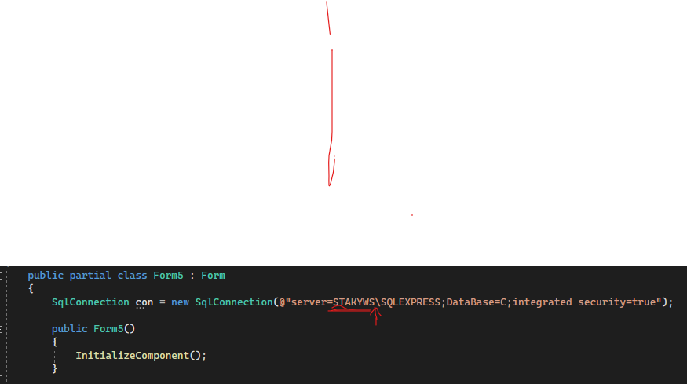
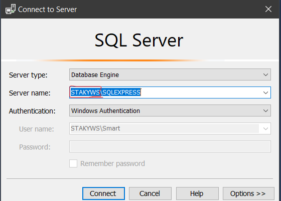
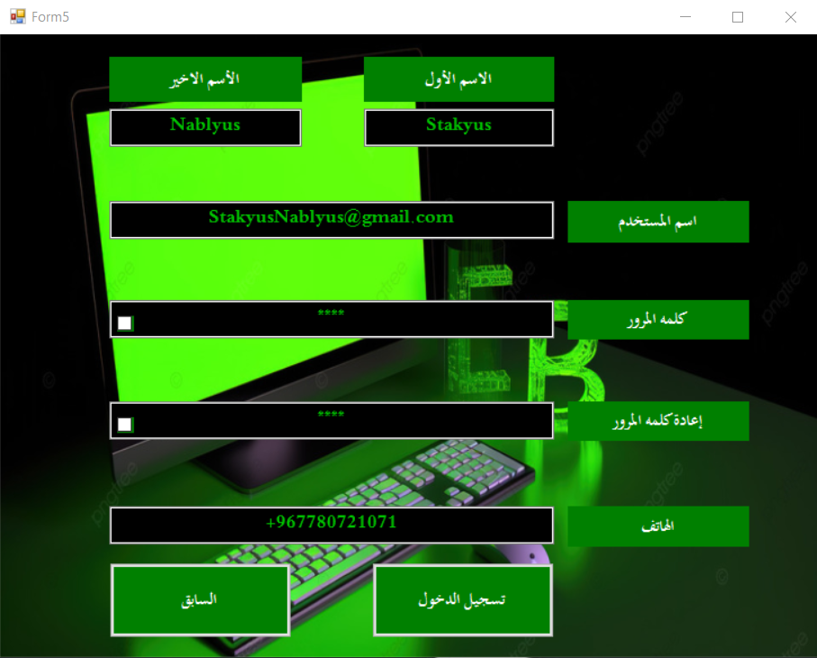
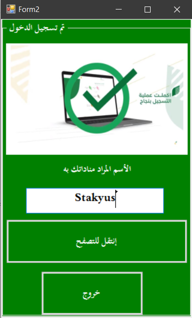
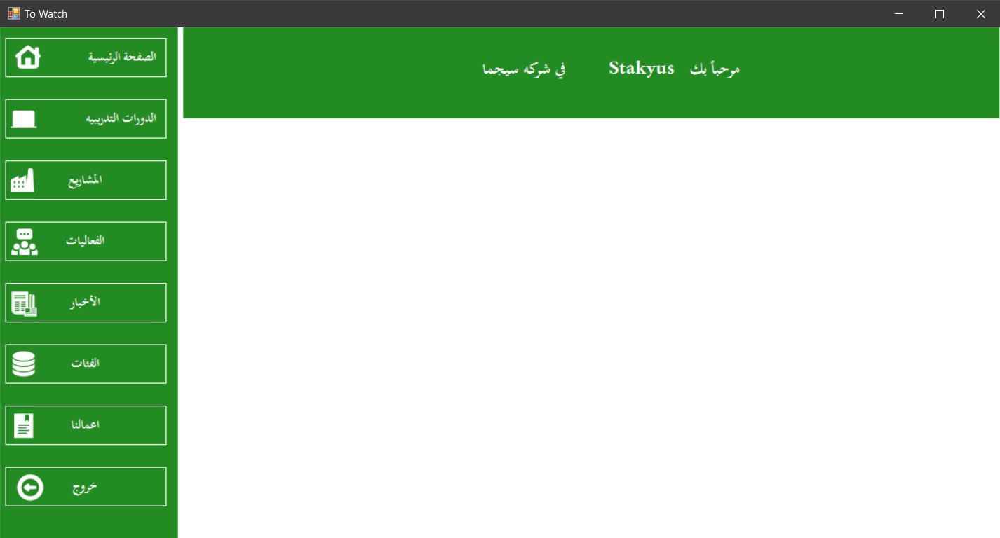
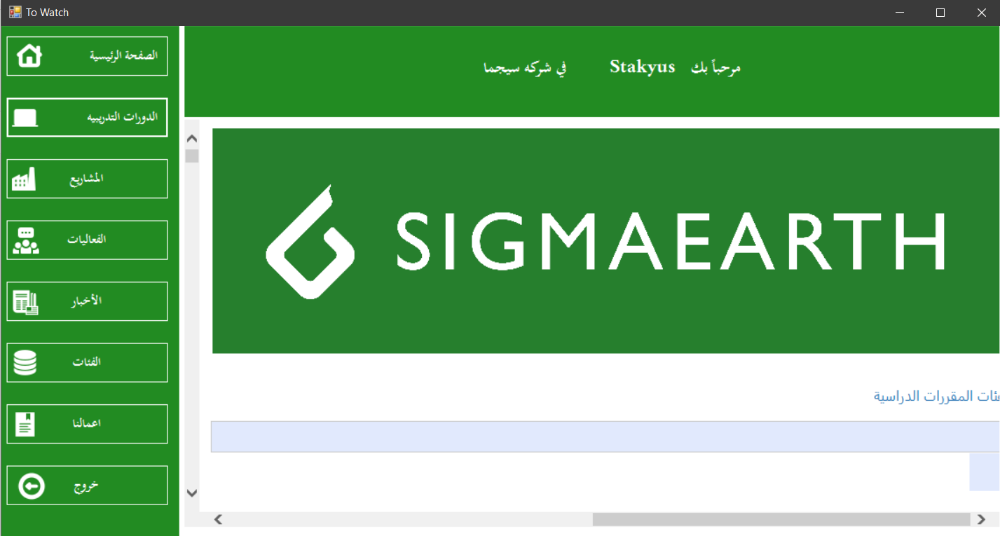
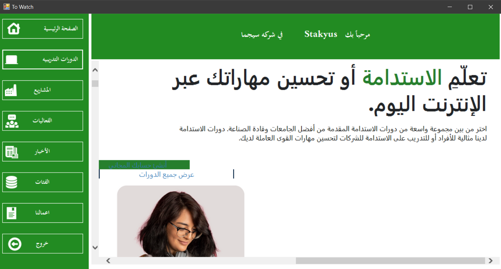
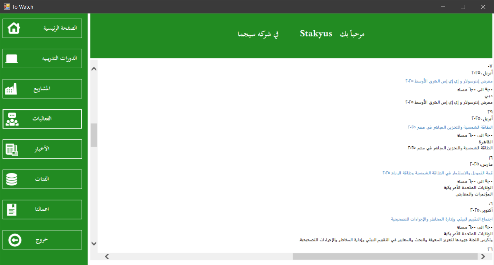
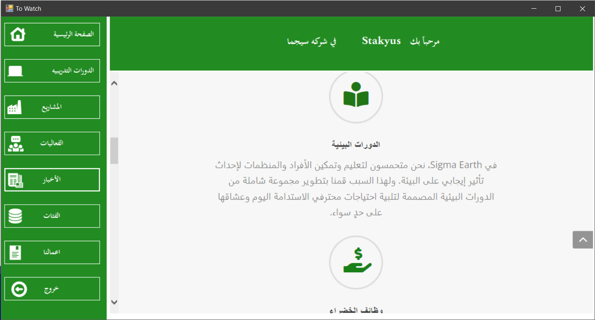
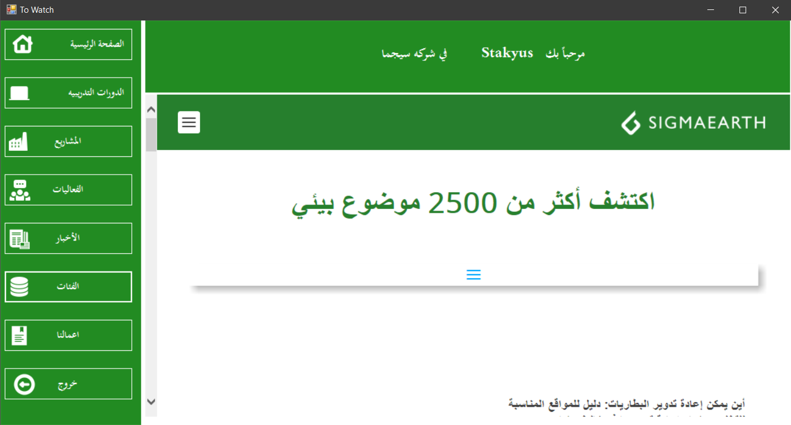

<h4>A C# program that consists of a login page, an account creation page, a username page, and the main page that contains a webview tool that displays all the slides for the specified site, as well as the use of many of the necessary techniques in any program other than this, such as design, creation, and programming codes used in the methods of linking with the database.</h4>

<h1>How to import database structure C.sql</h1>

<ul>
  <li>1- open SQL Server Management Studio (SSMS)</li>
  <li>2- Play file:
    <li>Open the C.sql file</li>
    <li>Execute the file (press F5 or click Execute).</li>
  </li>
</ul>

<h1>Database server connection code modifications</h1>

In my personal code, the name of my SQL server database is my server. I named it with a different name, so there are some simple steps that you have to do.

<ul>
  <li>1- Open the project file on Visual Studio and go to the Form 1, Form 5 and Form 6 code file and modify the server name from STAKYWS to the name of your server on the SQL Server as you can see in the image the text in the code that you have to modify  
    <li>
      

        
     

    </li>
  
     <li>You should also replace it with the name on the SQL Server marked in red, as in the picture.</li>
     
     <li>
       

        
       

     </li>
  </li>
</ul>

  
<h1>Program presentation</h1>

  

  

  

  

  

  

  

  

  

